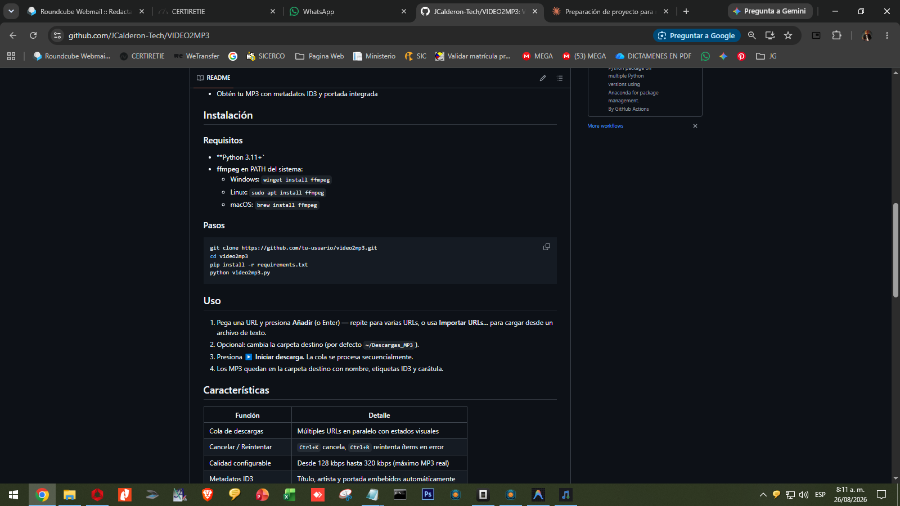

# Video2MP3

Descarga y convierte videos a MP3 desde más de 1000 sitios web.


## Demo



## Qué hace

Video2MP3 es una aplicación de escritorio que descarga videos y extrae su audio
en formato MP3 con calidad configurable (hasta 320 kbps). Motor de descarga:
`yt-dlp`. Extracción de audio: `ffmpeg`.

- Pega una URL de YouTube, Spotify, SoundCloud o cualquier sitio soportado
- Descarga y convierte en un solo paso
- Obtén tu MP3 con metadatos ID3 y portada integrada

## Instalación

### Requisitos

- **Python 3.11+**
- **ffmpeg** en PATH del sistema:
  - Windows: `winget install ffmpeg`
  - Linux: `sudo apt install ffmpeg`
  - macOS: `brew install ffmpeg`

### Desde código fuente

```bash
git clone https://github.com/JCalderon-Tech/VIDEO2MP3.git
cd VIDEO2MP3
pip install -r requirements.txt
python video2mp3.py
```

### Ejecutable (sin Python)

Descarga `Video2MP3.exe` desde la sección Releases. Solo necesitas
ffmpeg instalado en el equipo (ver requisitos arriba).

## Uso

1. Pega una URL y presiona **Añadir** (o Enter) — repite para varias URLs,
   o usa **Importar URLs...** para cargar desde un archivo de texto.
2. Opcional: cambia la carpeta destino (por defecto `~/Downloads/Video2MP3`).
3. Presiona **▶ Iniciar descarga**. La cola se procesa secuencialmente.
4. Los MP3 quedan en la carpeta destino con nombre, etiquetas ID3 y carátula.

## Características

| Función | Detalle |
|---|---|
| Cola de descargas | Múltiples URLs en paralelo con estados visuales |
| Cancelar / Reintentar | `Ctrl+K` cancela, `Ctrl+R` reintenta ítems en error |
| Calidad configurable | Desde 128 kbps hasta 320 kbps (máximo MP3 real) |
| Metadatos ID3 | Título, artista y portada embebidos automáticamente |
| Detección de duplicados | No sobrescribe MP3 existentes |
| Playlists | Pega una URL de playlist y descarga todos sus videos |
| Tema claro/oscuro | Paleta centralizada con contraste WCAG ≥ 4.5:1 |
| Configuración persistente | Carpeta, bitrate, ffmpeg, tema y geometría se guardan |
| Actualizar yt-dlp | Desde la app, para mantenerse al día contra 403/CVEs |
| Timeout de red | 30 s para que una conexión colgada no bloquee la cola |
| Cross-platform | Windows, Linux, macOS — rutas adaptativas |

## Atajos de teclado

| Atajo | Acción |
|---|---|
| `Enter` | Añadir URL a la cola |
| `Delete` | Quitar ítem seleccionado |
| `Ctrl+K` | Cancelar descarga en curso |
| `Ctrl+R` | Reintentar ítem en error |
| `Ctrl+O` | Abrir carpeta de salida |
| `Ctrl+I` | Importar URLs desde archivo |
| `Ctrl+U` | Actualizar yt-dlp |
| `Alt+...` | Mnemonics en botones (12 únicos) |

## Arquitectura

```
video2mp3.py
├── THEMES           # Paleta de colores centralizada (dark/light)
├── QueueManager     # Orquestación: cola, worker, yt-dlp/ffmpeg
├── DownloadItem     # Modelo de datos por URL (identificado por uid)
└── MainWindow       # Capa de presentación (PySide6/Qt6)
```

- **QueueManager** es el único punto de orquestación. La GUI nunca llama
  directamente a yt-dlp.
- **MainWindow** es presentación pura — sin lógica de negocio.
- Comunicación worker → UI: callbacks + `log_queue` (cola thread-safe)
  con refresco por `QTimer` cada 400 ms.

## Compilar a ejecutable

```bash
pip install pyinstaller
pyinstaller video2mp3.spec --noconfirm
# Resultado: dist/Video2MP3.exe
```

## Desarrollo

```bash
pip install -r requirements-dev.txt

# Lint
python -m ruff check video2mp3.py

# Typecheck
python -m mypy video2mp3.py

# Verificar compilación
python -m py_compile video2mp3.py
```

## Video tutorial

Se incluye `video.mp4` con un tutorial de 51 segundos que cubre:
pegar URL, descargar, configurar calidad y obtener el archivo final.

Creado por **Nexus_Calderon** con HyperFrames.

## Licencia

GPLv3 — uso libre. Respeta los términos de servicio de las plataformas
de origen al descargar contenido.
